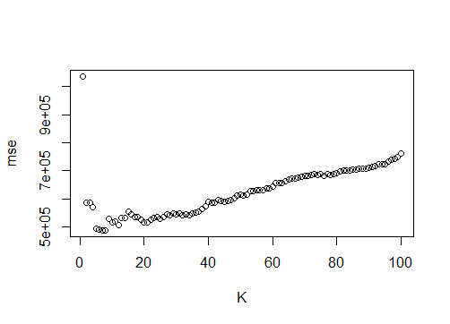
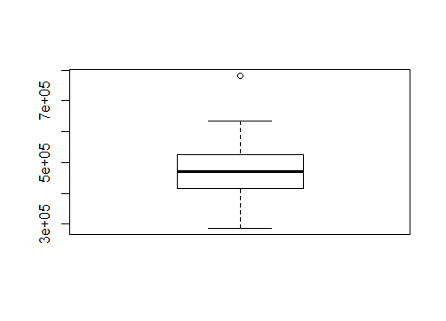
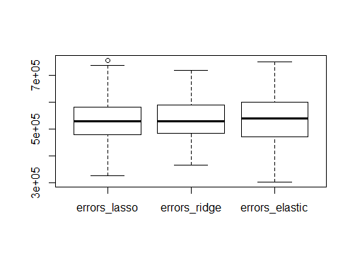
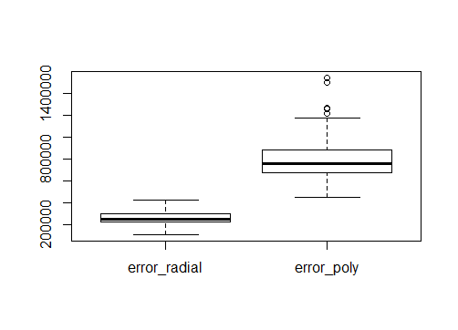
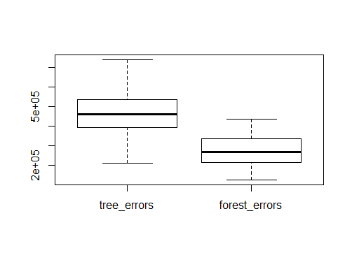
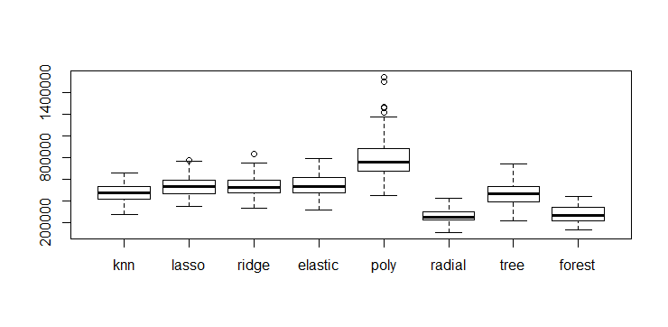

```{r, include=FALSE}
knitr::opts_chunk$set(fig.align = "center")
knitr::opts_chunk$set(fig.pos = "H", out.extra = "")
#load("env.RData")
```
# Introducion
Ce rapport présente le travail que nous avons réalisé au cours du deuxième projet de l'UV SY19. L'objectif de ce projet est d'appliquer différentes méthodes d'apprentissage sur 3 jeux de données différents. Pour chaque jeu, il faut comparer et optimiser les méthodes pour choisir celle qui a les meilleurs résultats. Nous devrons proposer un modèle par jeu de données qui sera testé avec de nouvelles données non étiquetées pour évaluer sa performance. Les jeux de données sont phoneme (problème de classification), Bike rental dataset (problème de régression) et letters recognition (problème de classification). Nous allons vous présenter nos travaux réalisés pour chaque jeu de données.


# Phoneme

```{r, include=FALSE}
load("phoneme.RData")
library(keras)
model.serialize <- serialize_model(load_model_hdf5("keras_out.h5"))
model <- unserialize_model(model.serialize)
```

## Analyse exploratoire

Cette première partie correspond à la classification des phonèmes. Le jeu de données contient 2250 observations avec 256 prédicteurs et une seule variable de réponse. On observe que la classification est en 5 classes et tous les prédicteurs sont quantitatifs. 


```{r phoneme-aexp, echo=FALSE}
summary(data$y)
```

On remarque ici que le nombre d'observations n'est pas équilibré parmi les classes. 

## Analyse en Composantes Principales 

On s'intéresse à une analyse en composantes principales afin de réduire le nombre de prédicteurs sachant qu'il y en a 256, ce qui est assez élevé. À l'aide de la fonction *prcomp()*, on trace la proportion de variance expliquée cumulée en fonction du nombre de composantes dans la figure \@ref(fig:phoneme-pca) ci-dessous. 

```{r phoneme-pca, echo=FALSE, fig.cap="Proportion de variance expliquée cumulée", out.width="50%"}
plot(cumsum(res.pca$sdev^2 / sum(res.pca$sdev^2)), type="l", ylim=0:1, ylab = "Cumulative Proportion", xlab = "number of PCs")
```

On constate que les 107 premières composantes expliquent 95% de variance. Du fait qu'il est préférable que le nombre d'entrées des couches des réseaux de neurones soit une puissance de deux, nous avons choisi de garder les 128 composantes principales pour la suite.

## Apprentissage de modèles

### LDA, QDA et Naive-Bayes

Le package **MASS** nous propose des fonctions pour les méthodes LDA (Linear Discriminant Analysis) et QDA (Quadratic Discriminant Analysis) et le package **naivebayes** pour un modèle Naive-Bayes. On observe que le taux d'erreur du modèle QDA est beaucoup plus haut que les deux autres. De ce fait, on constate que la matrice de covariance pour chaque classe reste quasiment identique. 


### Regression Logistique

Afin de réaliser une régression logistique pour une classification multinomiale, on utilise le modèle *multinom()* dans le package **nnet**. À partir de cette méthode, on réalise également un modèle additif généralisé en ajoutant une *natural cubic spline*. 

Ensuite, on teste la régression ridge et lasso. Le package **glmnet** nous permet de trouver *lambda* optimisé en faisant une validation croisée. Le modèle lasso nous donne de meilleurs résultats.

### Arbres de regression

Pour les méthodes basées sur les arbres, nous avons réalisé un arbre binaire de décision *rpart()* du package **rpart**. Nous l'avons élagué en choisissant une valeur **CP** qui minimise l'erreur de classification obtenue par validation croisée. Nous avons également réalisé un modèle **Bagging** et **RandomForest** en appliquant différentes valeurs de *mtry*.

### SVM

Nous avons appliqué la fonction *ksvm* du package **kernlab** pour tester la méthode SVM (Support Vector Machine) avec deux noyaux différents. Pour chaque noyau, on réalise d'abord une validation croisée pour trouver une valeur **C** optimisée parmi l'ensemble [0.001, 0.01, 0.1, 1, 10, 100, 1000, 10e4].

```{r phoneme-svm, echo=FALSE, fig.cap="Performance de modèles", fig.show="hold", out.width="45%"}
CC<-c(0.001,0.01,0.1,1,10,100,1000,10e4)
plot(CC,svm.linear.c,type="b",log="x",xlab="C",ylab="CV error (linear)")
plot(CC,svm.gaus.c,type="b",log="x",xlab="C",ylab="CV error (gaussian)")
```

### Réseaux de neurones

#### Réseau de neurones artificiel

On s'intéresse d'abord au réseau de neurones artificiel avec deux couches. Sachant que nous sommes sur un problème de classification, la fonction d'activation pour la couche de sortie est donc *softmax*. On paramètre le *batch_size* à 128 et l'*epoch* à 30. 

#### Réseau de neurones profond régularisé

Un réseau de neurones profond est un réseau de neurones artificiel avec plusieurs couches. Ici, on réalise un réseau de neurones profond avec 4 *layer_dense* et 2 *layer_dropout*. On fixe le coefficient à 0.5 pour les couches de régulation afin d'éviter un surapprentissage. On applique une fonction d'activation *relu* pour toutes les couches sauf celle de sortie. Les hyperparamètres à optimiser sont donc les *units* des deux couches au milieu. Après plusieurs essais en utilisant une validation croisée, nous n'observons pas d'amélioration très significative pour les différentes valeurs.


#### Réseau de neurones à convolution

Enfin, nous avons effectué un essai sur un réseau de neurones à convolution. Pour ce faire, il nous faut d'abord convertir les données en matrice 3D. Notre matrice de données est 2250\*128 (après extraction des caractéristiques). On choisit de la convertir en dimension 2250\*16\*8. La structure du modèle obtenue est comme ci-dessous. 


```{r phoneme-rnc, echo=FALSE}
summary(model)
```

## Comparaison de modèle

Pour finir, on réalise une comparaison de tous les modèles réalisés. Les performances de chaque méthode sont décrites sur les figures \@ref(fig:phoneme-mdl) et \@ref(fig:phoneme-nn)


```{r phoneme-mdl, echo=FALSE, fig.cap="Performance de modèles", out.width="120%"}
boxplot(lda.err, qda.err, nb.err,
        multinom.err, ridge.err, lasso.err,
        gam.err,
        rpart.err, prune.err, 
        bagged.err, rf.err,
        svm.linear.err, svm.gaus.err,
        names=c("lda", "qda", "nb", 
                "lr", "rid", "las",
                "gam",
                "rpa", "pru",
                "bag", "rf",
                "svml", "svmg"))
```

```{r phoneme-nn, echo=FALSE, fig.cap="Performance de réseau neurone", out.width="50%"}
boxplot(ann.err,
        dnn.err,
        cnn.err,
        names=c("ann", 
                "dnn",
                "cnn"))
```

On constate que le modèle du réseau neurones profond nous donne la précision la plus haute et la variance la plus petite. 


# Bike rental dataset

## Travail préliminaire

Le jeu de donnée contient 12 variables explicatives pour une variable à prédire. On cherche à prédire le nombre de vélos loué pour une journée en fonction de la saison, des conditions météorologiques, des jours ouvrés, etc. Il s'agit d'une tâche de régression. Nous disposons pour cela de 365 observations ce qui est relativement peu. Pour un petit dataset comme celui-là, nous avons décidé d'éliminer d'office les réseaux neuronaux qui nécessitent de grands jeux de données pour converger. Nous essaierons donc les principaux algorithmes d'apprentissage statistique nécessitant peu de données pour fonctionner.

De plus, 7 des 12 prédicteurs sont des variables qualitatives ! Il nous faudra donc des méthodes capables de gérer des variables qualitatives en même temps que des variables quantitatives. On pense directement aux arbres de décision qui sont plutôt versatiles. On pouvait penser que certaines variables seraient corrélées (saison et mois par exemple), mais puisque la plupart des variables sont qualitatives, une ACP ne fonctionnerait pas. On va donc compter sur les modèles pour sélectionner les bonnes variables. Encore une fois les arbres de décision devraient bien s'en sortir.


## KNN regression

En premier modèle, nous avons testé le modèle KNN, sans nous attendre à ce qu'il performe bien puisque ce dernier ne peut gérer les variables qualitatives. Le paramètre k a été trouvé par nested cross-validation. Comme prévu, le modèle ne performe pas particulièrement et notre meilleure erreur quadratique moyenne est de 483209.3 pour k=7.

{#id .class width=12cm height=6cm}

{#id .class width=12cm height=6cm}

## Elastic-net regression

Notre prochain modèle va permettre de faire de la sélection de variables. Le modèle Elastic-net, et ses cas particuliers ridge et lasso, permettent de faire une régression en sélectionnant les variables les plus utiles à la prédiction. Cependant, ils ne se comportent pas bien avec les données qualitatives. Et malheureusement cela rend les modèles peu précis tout comme le modèle KNN (cf. les boxplots d'erreurs).


{#id .class width=12cm height=6cm}


## SVM

Un SVM pourrait correctement traiter nos données avec un kernel adéquat sachant que nos données ne sont pas linéaires.

L'astuce est de trouver le bon kernel, ce qui n'est pas simple.

Avec un kernel radial, on trouve par nested cross-validation que le paramètre gamma doit être 1/7. On obtient alors une erreur quadratique moyenne d'environ 250000.

Avec un kernel polynomial, on trouve par nested cross-validation les paramètres du kernel polynomial et on obtient finalement une erreur quadratique moyenne d'environ 800000.

Le kernel linéaire donne de très mauvais résultats comme prévu. En effet on obtient une erreur quadratique moyenne supérieure à 500000.

{#id .class width=12cm height=6cm}


## Decision tree et random forest

C'est la méthode qui semble la plus prometteuse depuis l'analyse préliminaire. En effet, elle est robuste aux données qualitatives et permet aussi de sélectionner les prédicteurs les plus discriminants.

L'arbre de décision seul a tendance à overfit, on préférera donc les random forest qui généralisent mieux.

Comme prévu, l'arbre de décision seul overfit et donne de mauvais résultats : l'erreur quadratique moyenne est d'environ 450000.

La forêt aléatoire quant à elle n'overfit pas et donne de bons résultats, l'erreur quadratique moyenne est d'environ 250000. Elle égalise donc les performances du svm avec le kernel radial.


{#id .class width=12cm height=6cm}

## Sélection de modèle

La figure ci-dessous représente le récapitulatif des erreurs quadratiques moyennes obtenues.

{#id .class width=18cm height=9cm}

Nous avons donc décidé de retenir le modèle SVM avec kernel radial.

# Letter recognition
```{r, include=FALSE}
load("letter_workspace.RData")
```
## Données 
Le dataset Letter recognition contient 10 000 observations d'images de caractères de l'alphabet anglais qui ont été transformées en vecteur contenant seulement des indicateurs statistiques de l'image de départ. Il y a donc 17 variables explicatives, dont une correspondant au caractère. Les 16 autres correspondent aux indicateurs statistiques de l'image comme la largeur de l'image ou encore la position verticale de l'image. Cependant, les colonnes ont été aléatoirement permutées ce qui rend leur identification impossible. On cherche donc à prédire la lettre associée au vecteur de statistiques parmi 26 lettres de l'alphabet. 
On observe que les variables sont quantitatives. De plus, le nombre de variables étant faible, nous n'avons pas besoin d'effectuer une réduction de dimension (avec l'ACP par exemple).
Afin de comparer et d'évaluer les différentes méthodes d'apprentissage, nous allons utiliser la Cross Validation et la précision (accuracy) moyenne obtenue pour mesurer la performance.

## Apprentissage supervisée
### LDA, QDA et Naïve bayes
Tout comme pour le dataset phoneme, nous avons appliqué les méthodes d'apprentissages LDA, QDA et Naïve Bayes. Ces méthodes nous permettent de voir qu'on obtient de meilleurs résultats avec l'analyse discriminante quadratique. En effet, après avoir effectué une cross validation sur 10 folds avec les méthodes LDA, QDA et NB, on obtient respectivement une précision moyenne de 0.699, 0.882 et 0.634.

```{r letter-lda-qda-nb, echo=FALSE, fig.cap="Boxplot de la précision des méthodes LDA, QDA et NB", out.width="50%"}
boxplot(lda.acc, qda.acc, nb.acc,
        names=c("LDA", "QDA", "NB"))
```

### Regression Logistique
Nous avons également réalisé une régression logistique multinomiale (pour plusieurs classes). La validation croisée nous donne une précision moyenne de 0.767.

```{r letter-lr, echo=FALSE, fig.cap="Boxplot de la précision de la méthodes LR", out.width="50%"}
boxplot(multinom.acc,
        names=c("LR"))
```

### Réseaux de neurones
Avec le package Keras et sa documentation, nous avons implémenté un réseau de neurones profond. Il se compose de plusieurs couches. La première se compose de 128 neurones. On précise la taille d'entrée à 16 (p). La deuxième couche se compose de 64 neurones. La troisième et dernière couche se compose de 26 neurones correspondant aux probabilités pour chaque classe.
Nous avons utilisé une cross validation et effectué de nombreux tests afin d'affiner le nombre de neurones et les différentes options. De même nous avons remarqué que le dropout n'était pas adapté dans ce cas, car il diminue les performances du réseau de neurones.
On obtient une précision moyenne de 0.923.

```{r letter-nn, echo=FALSE, fig.cap="Boxplot de la précision obtenue par réseau de neurones ", out.width="50%"}
boxplot(nn.acc,
        names=c("NN"))
```

### Forêt aléatoire
Pour optimiser les hyper paramètres de la forêt aléatoire, nous avons utilisé la nested cross validation. On fixe le nombre d'arbres à 1100 et le mTry à 4 ($\sqrt{p}$)).
Nous avons également testé avec un bagging en changeant le mTry à 16 (p). Nous obtenons une précision moyenne de 0.95 pour la forêt aléatoire et 0.93 avec le bagging.

```{r letter-bagg-rf, echo=FALSE, fig.cap="Boxplot de la précision des méthodes Baggin et RF", out.width="50%"}
boxplot(bagged.acc, rf.acc,
        names=c("Bagging", "RF"))
```


### SVM
Pour la méthode SVM, on va optimiser le paramètre C par cross validation pour chaque noyau testé afin de trouver quelle valeur de C minimise l'erreur de classification. Nous avons testé les noyaux linéaires et gaussiens et nous trouvons respectivement une valeur de C de 1 et 100. En utilisant ces paramètres, nous obtenons une précision moyenne de 0.86 pour le noyau linéaire et 0.96 pour le noyau gaussien. 

```{r letter-svm, echo=FALSE, fig.cap="Boxplot de la précision des méthodes SVM", out.width="50%"}
boxplot(svm.linear.acc, svm.gaus.acc,
        names=c("SVM-Lin", "SVM-Gaus"))
```

### Sélection du modèle

Comme le montre la figure ci dessous, la méthode SVM avec noyau gaussien est donc la meilleure. Nous avons donc choisi cette méthode pour créer notre modèle d'entrainement.

```{r letter-all, echo=FALSE, fig.cap="Boxplot de la précision des méthodes testées", out.width="102%"}
boxplot(lda.acc, qda.acc, nb.acc,
        multinom.acc,
        bagged.acc, rf.acc,
        svm.linear.acc, svm.gaus.acc,
        nn.acc,
        names=c("lda", "qda", "nb", 
                "lr",
                "bagg", "rf",
                "svm_l", "svm_g",
                "nn"))
```
# Conclusion
Ce projet nous a permis de mettre en pratique les notions vues en cours sur des données réelles. Nous avons notamment pu utiliser de nouvelles méthodes d'apprentissages comme les réseaux de neurones qui se sont montrés performants puisque nous avons choisi un modèle de réseau de neurones profond pour le jeu de données phoneme. Nous avons également remarqué l'importance de l'optimisation des hyperparamètres des méthodes d'apprentissage. En effet, le modèle SVM s'est révélé être bien plus performant avec son paramètre C optimisé. À noter que deux de nos trois modèles utilisent SVM ce qui montre les bonnes performances de cette méthode.
